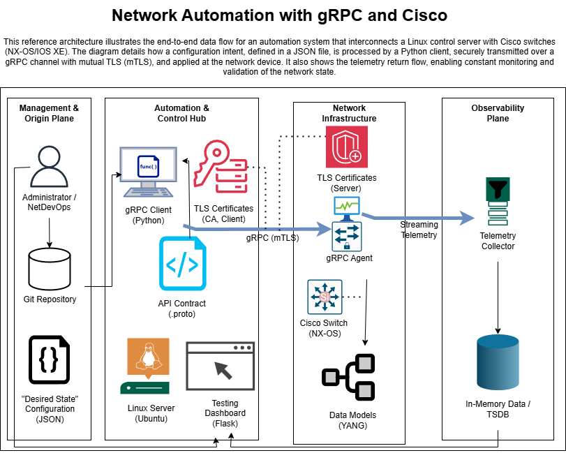

# gRPC Cisco Automation

## 📖 Sobre el Proyecto

**gRPC Cisco Automation** es un sistema integral de automatización de redes diseñado para administrar la configuración y monitorear el estado de switches Cisco (NX-OS/IOS XE) mediante un canal de comunicación seguro y eficiente.

Este proyecto implementa un enfoque de **Infraestructura como Código (IaC)**, permitiendo a los operadores de red definir el estado deseado de los dispositivos mediante archivos JSON estandarizados y aplicarlos programáticamente, eliminando el error humano de la configuración manual.

El sistema utiliza una **Arquitectura Híbrida** inteligente:
* **Telemetría:** Uso de `gRPC Streaming` con Protocol Buffers para la ingestión de datos de alta velocidad (CPU, Memoria, Tráfico).
* **Configuración:** Uso de túneles gRPC para el envío de comandos CLI, garantizando compatibilidad con dispositivos virtuales y físicos.

---

## 🚀 Características Principales

* **🔒 Seguridad Robusta:** Implementación de **mTLS (Mutual TLS)**. Tanto el servidor como el switch se autentican mutuamente mediante certificados digitales X.509.
* **📊 Dashboard en Tiempo Real:** Interfaz web moderna (tema Cyberpunk) que visualiza métricas críticas actualizadas cada 2 segundos.
* **⚙️ Automatización de Configuración:** Motor de despliegue que traduce definiciones JSON a comandos nativos de Cisco y muestra logs de ejecución en vivo.
* **🌐 Arquitectura Offline:** Diseño resiliente capaz de funcionar en entornos aislados (sin internet) mediante "sideloading" de librerías estáticas.
* **🧪 Mock Server Integrado:** Incluye un simulador de switch completo para desarrollo y pruebas sin necesidad de hardware físico.

---

## 🏗️ Arquitectura

El siguiente diagrama ilustra el flujo de datos completo del sistema, desde la definición de la configuración hasta la visualización de la telemetría.

🛠️ Instalación y Despliegue

Requisitos Previos
Linux (Ubuntu 20.04+ recomendado)

Python 3.8 o superior

OpenSSL

1. Clonar el repositorio

git clone [[https://github.com/tu-usuario/grpc-cisco-automation.git](https://github.com/Adrianmaiden/grpc-cisco-automation.git)](https://github.com/tu-usuario/grpc-cisco-automation.git)]

cd grpc-cisco-automation

2. Configurar el entorno virtual

python3 -m venv venv
source venv/bin/activate
pip install -r requirements.txt
3. Generar Certificados (PKI)
El sistema requiere una infraestructura de claves para funcionar. Ejecuta el script automatizado para crear la CA y los pares de llaves:

Bash

python3 generate_certs.py all
Esto creará la carpeta /certs con las credenciales necesarias.

💻 Uso

Para ejecutar una demostración completa del sistema en tu máquina local:

Paso 1: Iniciar el Simulador (Terminal 1)
Este servicio emula un switch Cisco NX-OS con gRPC habilitado.

source venv/bin/activate
python3 mock_server.py
Paso 2: Iniciar la Plataforma Web (Terminal 2)

source venv/bin/activate
python3 dashboard/app.py
Paso 3: Acceder
Abre tu navegador y visita: http://localhost:5000

🛡️ Seguridad

Este proyecto pone un fuerte énfasis en la seguridad operativa.

Cifrado: Todo el tráfico de gestión viaja encapsulado en TLS 1.2+.

Autenticación: No se permite ninguna conexión gRPC sin un certificado cliente válido firmado por la CA interna.

Para más detalles sobre nuestra política de seguridad, análisis de riesgos y cómo reportar vulnerabilidades, por favor consulta nuestro archivo SECURITY.md.

👥 Autores

Este proyecto ha sido desarrollado por:

Adrian Barroso Barrios

Diego Axel Estrada Ayala

Oscar Kevin Martinez Acosta

📄 Licencia

Distribuido bajo la Licencia MIT. Ver el archivo LICENSE para más información.
